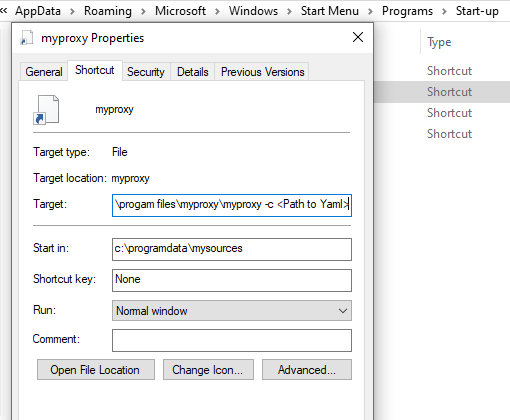

# GO myproxy proxy server based on httpproxy library

This is a proxy intended to be run in a user's context to be able to pass the user's authentication details to upstream proxies. 

It can read a Proxy Auto-Configuration file from local disk or a Web Server to determine the upstrem proxy or to go direct.

On Linux a user's Kerberos credentials can be provided or myproxy can read a user's Kerberos cache file ( FILE: format only for now ) for upstream proxy Negotiate authentication. 

On Linux a user's NTLM credentials can also be provided for upstream proxy NTLM authentication.

On Windows myproxy will use the SSPI interface i.e. no need to provide credentials for upstream proxy Negotiate and NTLM authentication. But if myproxy is run as a windows service the credentials will need to be provided for the service to logon with.

myproxy also supports upstrem proxy Basic authentication on Linux and Windows.

myproxy can read user passwords during startup instead of reading from YAML file.
 
myproxy logs to either stdout, a logfile, syslog(Linux) or event log(Windows). If run as a Windows service stdout is logged to c:\temp\myproxy_stdout.log.

On a multiuser system mproxy can user proxy Basic authentication to limit access to the myproxy port ( should only be used when listening on localhost ).

## Installing

```sh
git clone https://github.com/MMNetworks/myproxy.git

cd myproxy
go mod init myproxy
go mod tidy
go build myproxy.go version.go
```
### Linux

There are multiple ways to run myproxy. One option is to run it under systemd.  

Create a myproxy.services file in $HOME/.config/systemd/user


```sh
[Unit]
Description=Daemon for myproxy User Services

[Service]
Type=simple
#User=
#Group=
ExecStart=%h/.config/myproxy/bin/myproxy -c %h/.config/myproxy/conf/myproxy.yaml
Restart=on-failure
StandardOutput=file:%h/.config/myproxy/log/myproxy_%u.log

[Install]
WantedBy=default.target
```

Create the following directory structure:

$HOME/.config/myproxy  
$HOME/.config/myproxy/bin  
$HOME/.config/myproxy/log  
$HOME/.config/myproxy/conf  

Copy the myproxy binary file into $HOME/.config/myproxy/bin  
Copy the myproxy YAML config file into $HOME/.config/myproxy/conf  
Make the YAML file only accessible by the user if passwords are kept in it  
Copy the PAC file into $HOME/.config/myproxy/conf if used  

Run:
  
systemctl --user daemon-reload  
systemctl --user enable myproxy.service 

The proxy should start when the user logs into the system  

if it doesn't you can start manually with:  
 
systemctl --user start myproxy.service  

P.S. Make sure that each user uses a different localhost port.

### Windows

The easiest way is to start myproxy during system startup when the user logs in. i.e. create a myproxy shortcut in the start-up directory 



myproxy can also be started as a service using the -a option. e.g.

myproxy.exe -a install  
myproxy.exe -a start

The service options are: install, start, autostart, manualstart, stop, pause, continue, status and remove.

The install will create the service as a manual started service. autostart and manualstart options will toggle this setting.

If started manually via the Service UI the start paramters -c \<configfile\> have to be provided.

## Usage

Configuration is stored in a YAML file and can be supplied with a -c argument  

When using myproxy as Windows service make sure the file paths are absolute paths.

<ul>
<li>logging:</li>
<ul>
<li>setting for proxy logging. Default stdout and info level and no function call trace</li>
</ul>
<li>pac:</li>
<ul>
<li>setting for pac file. Reading from URL or FILE. Supports a proxy if PAC file is behind a proxy</li>
</ul>
<li>proxy:</li>
<ul>
<li>settings for upstream proxy. List of supported authentication methods in order of preference</li>
<li>LocalBasicUser and LocalBasicHash is used to authenticate to this proxy. Hash is created by createPwHash</li>
</ul>
<li>mitm:</li>
<ul>
<li>settings for TLS break of proxy connection.(default disabled) </li>
<li>needs either a string with key and certificate or file names pointing to a key and certficate</li>
<li>The include/exclude list can be used to bypass TLS break </li>
<ul>
<li>Syntax: &lt;src&gt;;&lt;source&gt;;&lt;regex&gt;
<ul>
<li>        source IP or subnet to include or exclude of prefixed with !</li>
<li>        the second value determines if the source IP is the connection IP or forwarded IP(client) if set or only the connection IP, when a forwarded IP is set(proxy) (i.e. connection IP is likely a downstream proxy). As default both IPs are checked against </li>
<li>        the third value is a regex to match the URL against.</li>
<li>The include/exclude file will be appended to the incexc list</li> 
</ul>
</ul>
</ul>
<li>ftp:</li>
<ul>
<li>setting default username / password for ftp. default anonymous / anonymous@myproxy
</ul>
</ul>

## YAML File format

```yaml
listen:
  ip: 127.0.0.1
  port: 9080
logging:
  level: "debug"
  file: "log_9080"
  trace: false
  accesslog: "access.log"
connection:
  timeout: 5
  keepalive: 5
ftp:
  username: "ftp"
  password: "anonymous@ftp.com"
mitm:
  enable: false
  key: ""
  cert: ""
  keyfile: "key.pem"
  certfile: "cert.pem"
  incexcfile: "incexcfile.txt"
  incexc: 
    - "!100.10.10.0/24;client;.*
    - "0.0.0.0/0;client;.*
pac:
  type: "FILE"
  url: "http://pac.com/pac_file"
  file: "pac_file"
  proxy: "http://proxy.test.com:3128"
proxy:
  authentication:
    - negotiate
    - ntlm
    - basic
  NTLMDomain: "TEST"
  NTLMUser: "testuser"
  NTLMPass: "BetterProvidedOnConsole"
  KRBDomain: "TEST.COM"
  KRBMUser: "testuser"
  KRBPass: "BetterProvidedOnConsole"
  KRBCache: "/tmp/krb5cc_testuser"
  KRBConfig: "/etc/krb5.conf"
  BasicUser: "TestUser"
  BasicPass: "BetterProvidedOnConsole"
  LocalBasicUser: "TestUser"
  LocalBasicHash: "eb97d409396a3e5392936dad92b909da6f08d8c121a45e1f088fe9768b0c0339"
```
